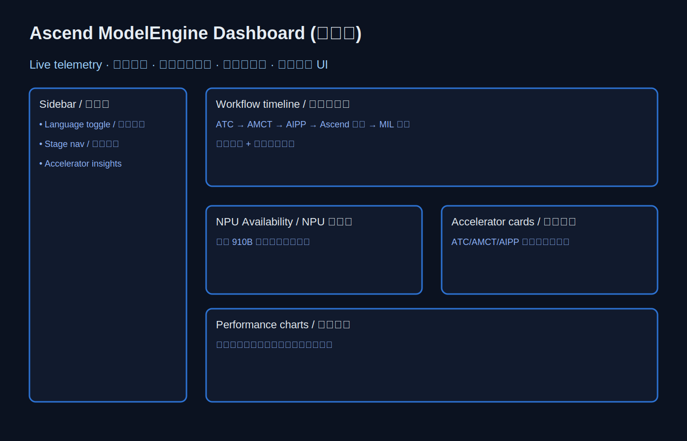
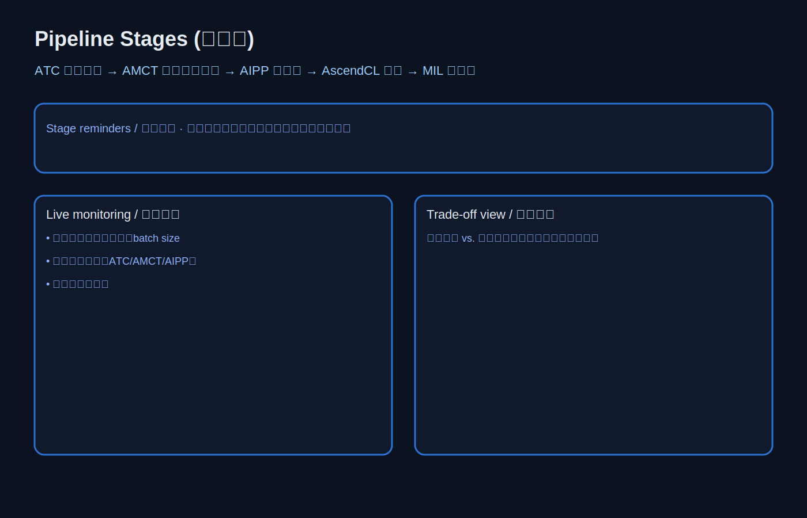
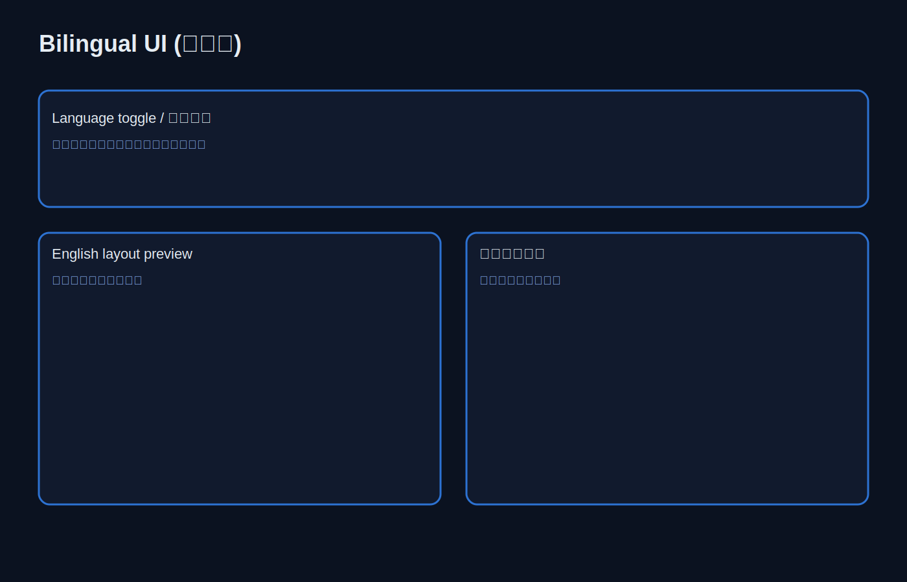

# Ascend ModelEngine ViT WSI Dashboard

本项目提供一站式（中英双语）仪表盘，用于在华为昇腾 910B NPU 上完成 UNI/ViT WSI 推理的全流程可视化：从 ATC 整图下沉、AMCT 混合精度量化、AIPP 预处理，到 AscendCL 推理与 MIL 后处理。仪表盘实时提示算力可用性、阶段进度、加速引擎与吞吐-时延权衡，帮助快速排查并验证端到端性能提升。

> **Note:** 当前仓库内的示意截图为静态 SVG 说明图（位于 `docs/screenshots/`），用来展示布局和关键功能。如需获得真实运行截图，请按下文步骤本地启动 `npm run dev` 后使用浏览器工具采集。

## 功能概览
- **中英双语切换**：侧边栏语言开关，界面、导航与提示同步翻译。
- **阶段时间轴与提醒**：ATC → AMCT → AIPP → Ascend 推理 → MIL 聚合的进度状态、耗时与当前步骤提示。
- **910B 可用性提示**：显示 NPU 连接状态、剩余容量、占用率，无法连接时给出备选建议。
- **加速引擎与性能卡片**：展示当前加速引擎（ATC/AMCT/AIPP/AscendCL）、吞吐提升倍数、时间自由度损耗与精度影响描述。
- **吞吐/时延/精度视图**：折线图对比基线与优化后的吞吐、时延与精度保持情况。
- **架构说明页**：以可视化方式介绍软硬件栈（ATC/AMCT/AIPP/AscendCL）与数据流向。

## 界面示意图
- 主仪表盘布局：
- 全流程阶段监控：
- 中英双语切换：

## 主要文件作用
- `App.tsx`：定义顶层路由（Dashboard、Architecture）与全局布局容器。
- `index.tsx`：React 入口，挂载应用并注入 i18n Provider。
- `index.css`：全局样式与暗色主题设定。
- `i18n.tsx`：多语言上下文，包含中英词条与语言切换逻辑。
- `constants.ts`：仪表盘展示的数据源（阶段描述、加速引擎信息、性能占位数据等）。
- `types.ts`：常用 TypeScript 类型声明（阶段、性能指标、语言等）。
- `components/Sidebar.tsx`：侧边导航、语言开关、资源/阶段快捷入口。
- `pages/Dashboard.tsx`：主仪表盘页面，包含阶段提醒、NPU 状态、加速卡片与性能图表。
- `pages/Architecture.tsx`：软硬件流程与数据流的可视化说明。
- `index.html` / `vite.config.ts` / `tsconfig.json`：Vite + TypeScript 项目的基础配置。

## 快速运行
1. 安装依赖：`npm install`
2. 开发模式启动：`npm run dev -- --host --port 4173`
3. 浏览器访问 `http://localhost:4173` 查看仪表盘；需要截图时，可使用 Playwright/浏览器工具连接该端口。

## 目录结构（节选）
```
ascend-modelengine-dashboard/
├── App.tsx
├── components/
│   └── Sidebar.tsx
├── pages/
│   ├── Architecture.tsx
│   └── Dashboard.tsx
├── constants.ts
├── i18n.tsx
├── types.ts
├── index.css
├── index.tsx
├── docs/
│   └── screenshots/
│       ├── dashboard.svg
│       ├── workflow.svg
│       └── bilingual.svg
└── package.json
```

## 备注与建议
- 如需对接真实 Ascend 910B 环境，请在 `constants.ts` 中填充实际的吞吐/时延采样数据与监控接口地址。
- 若使用 AMCT 量化或自定义 AIPP 配置，请同步更新对应提示文案与指标阈值。
- 项目使用 React 19 + Vite 6，推荐 Node.js ≥ 18，并在生产环境执行 `npm run build && npm run preview` 进行发布验证。
